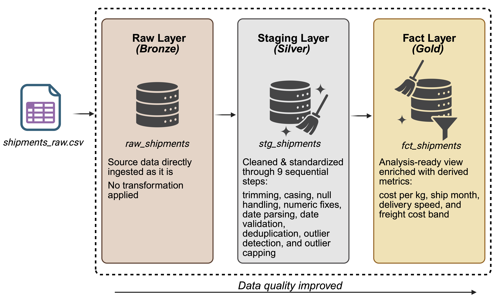

# 🚢 From Raw to Reliable: SQL Data Cleaning Pipeline for Shipment Data in BigQuery
*Transforming a messy, inconsistent shipment dataset into a clean, analysis-ready fact table through a structured three-layer SQL pipeline in BigQuery.*

---

## 🚦 Project Summary

Starting from a raw shipment dataset riddled with inconsistent casing, mixed date formats, negative values, duplicates, missing entries, and statistical outliers, this project builds a **structured three-layer SQL pipeline in BigQuery** that progressively cleans, standardises, and enriches the data layer by layer, step by step.

The result is a **fact view that is reliable, consistent, and ready for analysis**, along with full transparency into every transformation applied and why.

---

**Data:**
- `shipments_raw.csv` — 100 shipment records with intentionally introduced real-world data quality issues across 12 fields, covering carriers, routes, weights, costs, and dates.

**Tech & Approach:**
- SQL (Google BigQuery) for all data transformations
- A medallion-style three-layer architecture: **Raw → Staging → Fact**
- Key SQL techniques used:
  - CTEs (chained, step-by-step cleaning logic)
  - `SAFE.PARSE_DATE` with multiple format patterns for mixed date handling
  - `APPROX_QUANTILES` for IQR-based outlier detection
  - `ROW_NUMBER()` window function for duplicate removal
  - `COALESCE`, `NULLIF`, `CASE` for null handling and business logic
  - `DATE_DIFF` for transit time calculation and date validation
  - Derived metrics and categorical bucketing in the final layer

---

## 🔍 What Was Wrong With the Data

The raw dataset contained a realistic mix of data quality issues:

| Issue | Example |
|---|---|
| Inconsistent casing | `WAREHOUSE A`, `warehouse a`, `Warehouse A` |
| Leading / trailing whitespace | `"  Los Angeles  "` |
| Mixed date formats | `2024-01-10`, `01/15/2024`, `Feb 10 2024`, `March 7 2024` |
| Negative numeric values | `weight_kg = -45.2`, `items_count = -15` |
| Zero values used as placeholders | `weight_kg = 0.0`, `items_count = 0` |
| Missing values as empty strings | `ship_date = ""`, `destination_city = ""` |
| NULL stored as a string | `damage_reported = "NULL"` |
| Duplicate records | Same shipment appearing with different IDs |
| Impossible dates | Delivery date before ship date |
| Freight cost outliers | `$15,000` and `$11,312` among typical `$200–$900` values |

---

## 🏗️ Pipeline Architecture

The pipeline follows a **three-layer medallion architecture**, where each layer has a clear and distinct responsibility.



---

## 🌟 STAR Breakdown

### **SITUATION**
A logistics company generates shipment records across multiple warehouses, carriers, and destinations. The raw data is captured directly from operational systems with no preprocessing — resulting in a dataset full of inconsistencies, invalid entries, and quality issues that make it unsuitable for reporting or analysis in its original state.

### **TASK**
- Audit the raw dataset and catalogue all data quality issues
- Design and implement a multi-layer SQL pipeline to clean and standardise the data
- Preserve the original data untouched while building clean, auditable transformation layers on top
- Produce a fact table enriched with derived business metrics, ready for downstream analysis or dashboarding

### **ACTION**
- Built a **raw layer** as a direct copy of the source table — preserving the original state for auditability
- Designed a **staging layer** using chained CTEs to apply nine sequential cleaning steps, each documented and isolated for transparency
- Handled six different date formats using `SAFE.PARSE_DATE` with a `COALESCE` fallback chain
- Applied IQR-based outlier capping (Winsorisation) to `freight_cost` using `APPROX_QUANTILES`, rather than deleting anomalous rows, to preserve data integrity
- Used `ROW_NUMBER()` to identify and remove duplicate records based on key business fields
- Built a **fact layer** as a view on top of staging, adding derived metrics: `cost_per_kg`, `ship_month`, `delivery_speed`, and `freight_cost_band`

### **RESULT**
- **Casing & whitespace:** All string fields consistently formatted; no more mixed-case variants of the same value
- **Dates:** All six mixed formats unified into a clean `DATE` type; invalid and missing dates flagged via `data_quality_flag`
- **Numerics:** Negative weights and item counts corrected; zero placeholders replaced with `NULL`
- **Duplicates:** Duplicate shipment records identified and removed, keeping the earliest `shipment_id`
- **Outliers:** Extreme `freight_cost` values capped at IQR bounds; original values preserved in `original_freight_cost` for reference
- **Fact table:** Clean, enriched dataset ready for analysis, with transit time, delivery speed category, cost-per-kg, and monthly groupings all pre-calculated

---

## 🛠️ Tech Stack

| Tool | Usage |
|---|---|
| Google BigQuery | SQL engine and data warehouse |
| Standard SQL | All transformations and pipeline logic |
| BigQuery `SAFE.*` functions | Safe date parsing without query failure |
| `APPROX_QUANTILES` | Approximate IQR calculation for outlier detection |

---

## 📁 Project Structure

```
├── data/
│   └── shipments_raw.csv              # Raw source data with all original quality issues
│
├── docs/
│   └── data_catalog.md                # Column definitions, types, and data quality notes
│
├── images/
│   └── pipeline_architecture.png      # Medallion architecture diagram (Bronze → Silver → Gold)
│
├── scripts/
│   ├── 01_create_raw_shipments.sql    # Raw layer: direct copy of source table
│   ├── 02_create_stg_shipments.sql    # Staging layer: full cleaning pipeline
│   └── 03_create_fct_shipments.sql    # Fact layer: clean view with derived metrics
│
└── README.md
```

---

### ⚠️ Copyright & Usage Notice
**All code, analysis, and documentation in this repository are original work by me, Dilsah Nur Elmaci.**
If you would like to reference, reuse, or learn from any part of this project, please **reach out or provide clear attribution**.
I kindly ask that you do not copy or reproduce these materials without permission. Thank you for respecting my work! 💌
