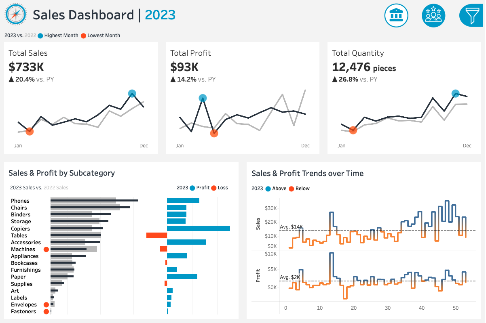
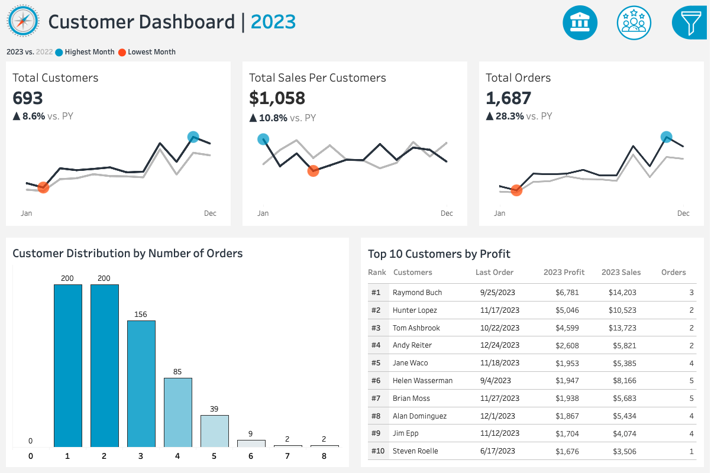

# 🧠 Retail Intelligence: Interactive Sales & Customer Performance Dashboards

An interactive business intelligence project built with **Tableau** to visualize and analyze **retail sales performance, profitability, and customer behavior for a company operating in the office supplies and technology sector** across multiple U.S. regions.

---

## 🎯 Project Overview

This Tableau project combines four datasets (*Orders*, *Products*, *Customers*, and *Location*) into a unified data model that delivers a holistic view of business performance.  
The dashboards are designed for **sales managers, executives, and marketing teams to explore year-over-year performance, product profitability, and customer engagement patterns through rich interactivity**.

---

**Domain:** Retail / Office Supplies  
**Objective:** Provide actionable insights into sales growth, profit trends, and customer loyalty.  
**Tools & Features:** Tableau Public · Data Blending & Relationships · Calculated Fields · Dynamic Parameters · Interactive Filters · Dashboard Actions · KPI Design · Data Visualization

**🟢 Live Dashboards on Tableau Public 🟢:** 
[Sales & Customer Performance Dashboards](https://public.tableau.com/views/SalesandCustomerDashboard_17602733710230/SalesDashboard?:language=en-US&:sid=&:redirect=auth&:display_count=n&:origin=viz_share_link) 

---

## 🌟 STAR Breakdown

### **SITUATION**
The company sells office supplies and technology products (Phones, Chairs, Binders, Tables, etc.) across multiple U.S. regions.  
Although it collected detailed sales and customer data, **it lacked an integrated dashboard to track performance and profitability trends over time**.


### **TASK**
- Combine multiple data sources into one analytical model in Tableau.  
- Design two interactive dashboards:  
  - **Sales Dashboard:** Monitor company-wide sales and profit KPIs.  
  - **Customer Dashboard:** Analyze customer base growth, loyalty, and order behavior.  
- Enable filtering by **Year**, **Category**, **Subcategory**, and **Location** for in-depth exploration.


### **ACTION**
- **Data Preparation:**  
  - Joined 4 datasets using Customer ID, Product ID, and Location ID.  
  - Created calculated fields for YoY Growth, Profit Margin, and Ranking.  
- **Dashboard Design:**  
  - Designed KPI cards showing YoY trends for key metrics.  
  - Added monthly and weekly trend charts with above/below average indicators.  
  - Built comparative visuals for Sales vs. Profit across product subcategories.  
  - Integrated navigation buttons for seamless dashboard switching.  
- **Interactivity/Filters:**  
  - Dynamic **Year (2020–2023)** filter.  
  - Product filters by **Category** and **Subcategory**.  
  - Geographic filters for **Region**, **State**, and **City**.  

---

## 📈 RESULTS & RECOMMENDATIONS

### 🧾 **1️⃣ Sales Dashboard**

#### **KEY INSIGHTS**
Between 2020 and 2023, **total sales increased by over 50%** (from $484K to $733K), showing steady YoY growth except for a brief dip in 2021.  
Profitability improved significantly, especially between 2021 and 2022, when both sales and profit grew by more than 30%.  

Phones and Chairs consistently led in sales and profit, while Machines and Tables generated strong revenue but fluctuating margins.  
Seasonality patterns revealed demand peaks in **December** and slowdowns in **January**, aligning with end-of-year purchasing cycles.  

#### **RECOMMENDATIONS**
- **Prioritize High-Margin Categories:** Focus marketing and inventory on Phones and Chairs.  
- **Reassess Machines Category:** Review pricing and cost structure to improve consistency.  
- **Leverage Seasonality:** Plan campaigns ahead of December peaks and adjust Q1 stock levels.  
- **Expand Regional Insights:** Identify best-performing regions and replicate successful practices.  
- **Monitor Growth Slowdown:** The moderate deceleration in 2023 suggests a need for diversification or new product lines.


### 👥 **2️⃣ Customer Dashboard**

#### **KEY INSIGHTS**
From 2020 to 2023, the company’s customer base expanded by **16.4%** (595 → 693), while **total orders increased by 74%** (969 → 1,687), signaling strong customer acquisition and retention.  
Average sales per customer rose from **$814 to $1,058** (+30%), indicating higher engagement and spending.  

Most customers placed 1–2 orders, but the share of repeat buyers increased steadily, which is a positive sign of growing loyalty.  
High-value customers remained key profit contributors, though profit distribution widened to include a healthier mix of new and returning clients.  

#### **RECOMMENDATIONS**
- **Loyalty Incentives:** Reward 3+ order customers with exclusive benefits or loyalty tiers.  
- **Customer Segmentation:** Target 2-order customers with personalized retention campaigns.  
- **CRM Strategy:** Strengthen engagement during lower-performing years (e.g., 2021).  
- **Cross-Selling:** Encourage customers to purchase across multiple categories.  
- **Monitor Top Clients:** Track top 10 customers’ contribution and mitigate potential churn.

---

## 🧭 Filter Panel Features

A unified filter sidebar enables dynamic multi-dimensional analysis:

| Filter | Options | Purpose |
|---------|----------|----------|
| **Year** | 2020–2023 | Compare yearly performance |
| **Category** | Furniture · Office Supplies · Technology | Analyze product segments |
| **Subcategory** | 17 product types | Identify top/bottom performers |
| **Region** | Central · East · South · West | Regional analysis |
| **State / City** | 50+ states & 100+ cities | Local-level performance |

---

## 🧱 Data Model & Sources

| Dataset | Description |
|----------|--------------|
| **Customers.csv** | Customer details (ID, name, contact info) |
| **Orders.csv** | Transaction data including sales, profit, and quantity |
| **Products.csv** | Product category and subcategory mapping |
| **Location.csv** | Regional, state, and city-level geographic data |

---

## 🧩 Dashboards Overview

### **Sales Dashboard**
- **KPIs:** Total Sales, Total Profit, Total Quantity  
- **Visuals:** Monthly and Weekly trends, Subcategory comparison  
- **Highlight:** December peaks, top subcategories by profit  

📸 *Preview:*  


🔗 **View the Live Dashboards on Tableau Public:**  
[Sales Performance Dashboards](https://public.tableau.com/views/SalesandCustomerDashboard_17602733710230/SalesDashboard?:language=en-US&:sid=&:redirect=auth&:display_count=n&:origin=viz_share_link)

---

### **Customer Dashboard**
- **KPIs:** Total Customers, Total Orders, Sales per Customer  
- **Visuals:** Customer distribution, Top 10 by profit  
- **Highlight:** Repeat purchase trends and loyalty growth  

📸 *Preview:*  


🔗 **View the Live Dashboards on Tableau Public:**  
[Customer Performance Dashboards](https://public.tableau.com/views/SalesandCustomerDashboard_17602733710230/CustomerDashboard?:language=en-US&:sid=&:redirect=auth&:display_count=n&:origin=viz_share_link)

---

## 📁 Project Structure
```
├── data/
│   ├── Customers.csv
│   ├── Orders.csv
│   ├── Products.csv
│   └── Location.csv
│
├── dashboards/
│   ├── Sales_Dashboard_2023.png
│   └── Customer_Dashboard_2023.png
│
├── user_story_specs/
│   ├── README.md
│
└── README.md
```

---

## 🎬 Final Remarks
This project showcases advanced **Tableau dashboard design** by transforming raw retail data into an **interactive decision-support system**.  
Through year-over-year trend analysis, product-level comparisons, and customer segmentation, it enables business leaders to make informed decisions that drive growth, efficiency, and customer loyalty.

---
### ⚠️ Copyright & Usage Notice

The dashboards and this repository, including their explanations and documentation, were created by me, Dilsah Nur Elmaci.

Special thanks to Baraa Khatib Salkini for the dataset, user story, and inspiration and guidance for the dashboards.

Please **credit this repository** if you reference, adapt, or reuse any part of it. 💌